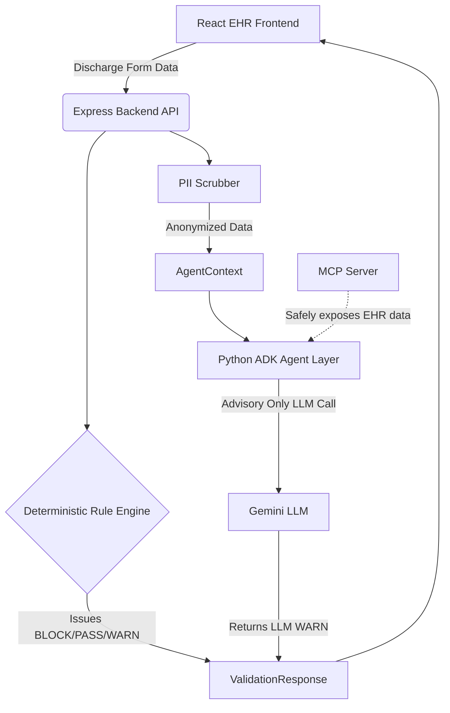

# Clinical Safety Agent 🏥🤖

[](https://www.docker.com/)
[](https://reactjs.org/)
[](https://nodejs.org/)
[](https://www.python.org/)

**A Deterministic & Agentic Safety Copilot for Hospital Discharge Planning**

---

## 🎯 The Problem

Hospital discharge planning is notoriously complex and fraught with liability. Discharging a patient without confirming transportation for an oxygen tank, verifying home stairs for a wheelchair-bound patient, or ensuring proper signatures can lead to severe adverse events, readmissions, and lawsuits.

Generative AI shows massive promise for reviewing these complex plans. **However, LLMs hallucinate.** You cannot trust an LLM to override a critical safety requirement.

## 💡 The Solution

The **Clinical Safety Agent** is a hybrid intelligence system combining the power of Agentic Workflows (ADK) with a strict, **Deterministic Safety Engine**.

1. **The Guardrail:** A Node/Express backend acts as an immovable safety net. It runs deterministic logic against the discharge payload. If a rule fails (e.g. `MOBILITY_STAIRS_NO_ELEVATOR`), it issues a `BLOCK`.
2. **The Scrubber:** An aggressive PII scrubber ensures no protected health information (PHI) ever reaches the LLM.
3. **The Agent:** An ADK Python Agent securely parses the anonymized case via MCP Server tools, reads the deterministic rules, and provides an LLM-driven advisory review.
4. **The Guarantee:** The LLM can only output `WARN`. It **cannot** override a deterministic `BLOCK`.

## 🏗️ Architecture



### Key Technical Achievements
- **Model Context Protocol (MCP)** integration for safe EHR reads.
- **Agentic Development Kit (ADK)** state machine controlling the LLM flow.
- **Robust Security Middleware:** CORS, Helmet, Rate Limiting, Pre-commit Secret Scanning.
- **TDD Enforcement:** 30+ tests across Jest, Vitest, and Pytest.

---

## 🚀 Setup Instructions

This project is built for immediate local deployability via Docker. 

### Prerequisites
- Docker & Docker Compose
- Node.js v20+ & npm (if running locally without Docker)
- Python 3.11+ & `uv` (if running agent locally)

### Option 1: One-Click Docker Deploy (Recommended)
From the root of the repository, simply run:
```bash
docker compose up --build
```
- The React Frontend will be available at: `http://localhost:5173`
- The Express Backend will run on: `http://localhost:3001`
- The MCP Server will attach dynamically.

### Option 2: Local Development
If you prefer running the stack natively, you need three terminal tabs:

**Tab 1: Backend**
```bash
cd backend
npm install
npm test
npm run dev
```

**Tab 2: Frontend**
```bash
cd frontend
npm install
npm test
npm run dev
```

**Tab 3: ADK Agent**
```bash
agents-cli install
uv run pytest tests/integration/test_discharge_agent.py
agents-cli run "Review MRN-300 discharge with Standard Taxi/Rideshare transport."
```

## 🎥 Demonstration

A full demonstration video of the architecture, the UI, and the agentic workflow is available in the Kaggle Submission Writeup. 

### 🛡️ Pre-Commit Hook Security
This repository utilizes a strict STRIDE/OWASP native git hook that runs on every commit to prevent secret leakage (API keys) and ensure all 33 tests pass before code can be pushed.
