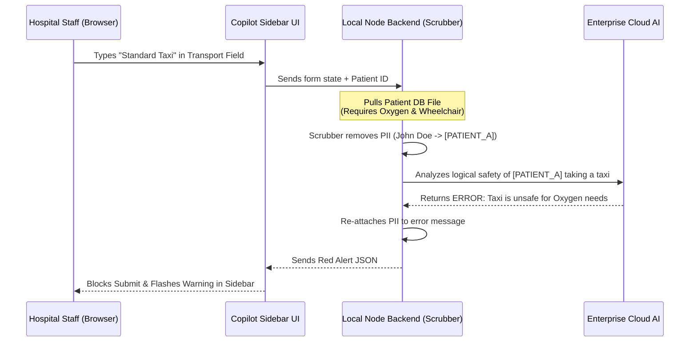

# Goal Description
Build the "Social Services Copilot" – an ambient AI overlay for hospital discharge planning. It intercepts data typed by hospital staff (Social Workers, Case Managers, Admins) in real-time, scrubs it of PII, and cross-references it against clinical requirements using an LLM to prevent deadly discharge errors.

## Finalized Architectural Decisions
1. **Tech Stack:** **Vite + React** (Frontend) and Node.js/Express (Backend Scrubber). Vite is lightweight and perfect for building a sidebar widget.
2. **AI Provider:** We will use a real LLM via an API key provided in a local `.env` file.
3. **UI Design:** A **Sidebar UI** (inspired by the Careerflow extension). Instead of a tiny floating bubble, the Copilot will live in a persistent, clean sidebar on the right side of the screen. This allows ample space to display the "Discharge Readiness Score", checklist, and detailed Green/Yellow/Red alerts.

## Proposed Architecture Pipeline

## Proposed Changes

We will construct the project in `c:/Cap-KxG/` using a standard monorepo structure.

### 1. Frontend (The Overlay Sidebar & Mock EHR)
- Initialize a **Vite + React** application.
- Build the "Mock EHR" (representing Epic/Cerner) as the main page.
- Build the **Copilot Sidebar Widget** (Careerflow style) that slides out on the right.

### 2. Backend (The Logic Engine & Scrubber)
- Initialize a Node.js/Express server.
- Build the `PII Scrubber Middleware` (Regex/NLP to remove names, dates, SSNs).
- Build the `Rule Engine Controller` (prompts and API calls to the real LLM).
- Build the mock `FHIR Database` (JSON files representing the clinical notes of fake patients).

### 3. Pre-Commit Automation (Rule #10)
- Install Husky and lint-staged.
- Configure pre-commit hooks to run tests and linters before any code is permanently committed.

## Verification Plan

### Automated Tests
- We will write unit tests specifically for the **PII Scrubber** to mathematically guarantee no unmasked names leak into the AI payload.
- We will run `npm run test` automatically via Husky hooks.

### Manual Verification
- We will spin up the local environment and physically type a dangerous combination (e.g., Oxygen + Taxi) into the UI to ensure the sidebar flashes red and physically blocks submission.
